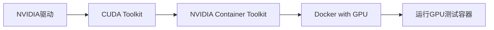

# 基于Docker+vLLM的Hunyuan-MT-7B翻译大模型部署实践

欢迎来到一个全新的挑战！相信大家在日常学习和生活中已经或多或少地体验过大型语言模型（比如 ChatGPT，DeepSeek，豆包等）的强大能力，无论是流畅的对话、惊艳的文案创作，还是精准的代码生成。我们常常是这些尖端技术的“使用者”，但你是否想过，如何亲自将一个强大的AI模型“运行”起来，让它成为一个可以随时调用的服务？

这次，我们将深入探索在人工智能领域中，如何将一个强大的大语言模型（LLM）进行高效部署，并最终呈现为一个可交互的应用。腾讯开源的 Hunyuan-MT-7B 翻译模型，在WMT25竞赛中取得了31个语言类别中30个第一的惊人成绩，支持包括5种中国少数民族语言在内的33种语言互译。但如何将这样的大模型高效部署到生产环境中，并为用户提供稳定的服务接口，是每位工程师都需要掌握的核心技能。

在当今云计算和微服务架构盛行的时代，容器化技术已经成为软件开发和部署的标准实践。想象一下，当你在本地开发完一个应用后，如何确保它能在生产环境中完美运行？"在我电脑上能跑"这句话已经成为程序员的经典梗，而Docker正是解决这个问题的利器。Docker就像是应用程序的"集装箱"，它将应用及其所有依赖打包在一起，确保在任何环境下都能一致运行。从互联网巨头的微服务架构，到初创公司的快速迭代，Docker已经深入到软件开发的方方面面。

然而，仅仅将模型“运行起来”还不够。当多个用户同时请求服务时，传统的推理方式会变得非常缓慢，并且极度消耗宝贵的显存资源。这时，**vLLM 闪亮登场。它不仅仅是一个服务框架，更是一个专为大语言模型推理打造的高性能引擎。** 其核心创新（如 PagedAttention 技术）能够像操作系统管理内存一样，精细化地管理GPU显存，从而实现惊人的性能提升。这意味着**更高的吞吐量（同时服务更多用户）、更低的延迟（响应速度更快）**。当我们将 vLLM 的极致性能与 Docker 的标准化部署相结合，就拥有了一套业界领先、可移植、可扩展的大模型服务解决方案。在这个过程中，我们将接触到：

*   **Linux 操作系统**：作为绝大多数服务器的首选系统，你将熟悉其基本命令行操作。
*   **Docker 容器化技术**：学习如何打包、分发和运行应用，实现 “一次构建，处处运行”，彻底解决环境配置的难题。
*   **大模型推理与服务化**：了解 vLLM 这样的高性能推理框架如何让大模型运行得更快，并将其封装成一个标准的 API 接口。
*   **前后端交互**：体验一个完整的 Web 应用如何由前端（用户界面）和后端（模型服务）协同工作。

### **注意：** 

1. 考虑到大模型对硬件资源，特别是显存（VRAM）的高要求。普通游戏本基本满足部署 7B（70 亿参数）级别模型所需的基本显存，但是想要更快的推理速度，**推荐使用配备有高性能 NVIDIA 显卡的个人电脑（或者搭载 M 系列处理器的苹果电脑）或 GPU 服务器来完成此项目**。
2. 目前 Docker 国内镜像源无法正常使用，慎选。有条件的同学请自行了解如何使用科学上网。
3. 所有给出的脚本均**作为参考**，请根据实际情况进行调整。
4. 想要通过考核，你至少要完成 **Level 4**。考核说明和提交要求详见：[https://sdnuroboticsailab.github.io/orientation/2025/2025-autumn-engineering-challenges/](https://sdnuroboticsailab.github.io/orientation/2025/2025-autumn-engineering-challenges/)

## Level 0： 认识核心工具链

在动手之前，我们需要先理解本次任务中涉及的关键技术分别是什么，以及它们为何如此重要。

- **学习 Linux 基础**：学习并掌握最常用的 Linux 命令行指令，因为绝大部分的服务器和开发环境都基于 Linux 系统。

* **理解 Docker**：弄清楚什么是容器？什么是镜像？Dockerfile 是做什么用的？Docker 与传统虚拟机相比有哪些优势？
* **Git版本控制**：解释Git的基本工作流程，说明`git clone`、`git pull`、`git push`的作用
* **了解 vLLM**：vLLM 是什么？它为什么能让大模型推理变得更快、更高效？PagedAttention 是什么原理？
* **熟悉 Hunyuan-MT-7B**：了解这是一个专注于翻译任务的70亿参数大模型，并大致浏览其支持的语种。

### **提交要求：**

- 提交一份Markdown文档，记录学习笔记；
- 给出上面问题的回答。每个回答尽可能详细，体现你的理解。

### **参考和学习资料：**

1. #### 系统培训课程

  * 机器人实验室往年Linux、Git、Python培新：[https://space.bilibili.com/3546615520430884](https://space.bilibili.com/3546615520430884)
  * 红岩网校运维安全部课程：[https://space.bilibili.com/1504551074/lists/4139430?type=season](https://space.bilibili.com/1504551074/lists/4139430?type=season)

2. #### 学习教程

- Git学习教程：[https://sdnuroboticsailab.github.io/resource/software/Git/Git_Introduction/](https://sdnuroboticsailab.github.io/resource/software/Git/Git_Introduction/)
- Git 使用攻略：[https://www.bilibili.com/video/BV1u94y1n73L](https://www.bilibili.com/video/BV1u94y1n73L)
- Git使用攻略2：[https://www.bilibili.com/video/BV1d6XVYqEuy](https://www.bilibili.com/video/BV1d6XVYqEuy)
- Linux 入门教程：[https://sdnuroboticsailab.github.io/resource/software/Linux/getting-started-with-linux-terminal/](https://sdnuroboticsailab.github.io/resource/software/Linux/getting-started-with-linux-terminal/)
- Docker 入门教程：[https://www.ruanyifeng.com/blog/2018/02/docker-tutorial.html](https://www.ruanyifeng.com/blog/2018/02/docker-tutorial.html)
- Docker 实践攻略：[https://www.bilibili.com/video/BV1THKyzBER6](https://www.bilibili.com/video/BV1THKyzBER6)

3. #### 双系统安装、软件安装、环境配置

  * 使用 WSL 安装 Ubuntu 教程：[https://sdnuroboticsailab.github.io/resource/software/Linux/first-vm-2024/#wsl-ubuntu](https://sdnuroboticsailab.github.io/resource/software/Linux/first-vm-2024/#wsl-ubuntu)
  * 安装 Ubuntu 24.04 双系统：[https://hs.cnies.org/archives/dual-boot-ubuntu2404-win11](https://hs.cnies.org/archives/dual-boot-ubuntu2404-win11)
  * Ubuntu 软件安装、使用技巧、系统优化教程：[https://hs.cnies.org/archives/ubuntu2404-optimize](https://hs.cnies.org/archives/ubuntu2404-optimize)
  * Anaconda 安装和配置：[https://hs.cnies.org/archives/conda-win](https://hs.cnies.org/archives/conda-win)
  * wsl安装Docker教程1：[https://blog.jojo.host/posts/dxdhlMjMt/](https://blog.jojo.host/posts/dxdhlMjMt/)
  * wsl安装Docker教程2：[https://seepine.com/docker/wsl-install/](https://seepine.com/docker/wsl-install/)
  * Ubuntu24.04 安装docker：[https://www.liuwg.com/archives/ubuntu24.04-an-zhuang-docker](https://www.liuwg.com/archives/ubuntu24.04-an-zhuang-docker)

4. #### vllm 部署文档

  * vllm 中文文档：[https://vllm.hyper.ai/docs/getting-started/quickstart/](https://vllm.hyper.ai/docs/getting-started/quickstart/)
  * vllm 部署模型调用：[https://qwen.readthedocs.io/zh-cn/latest/deployment/vllm.html](https://qwen.readthedocs.io/zh-cn/latest/deployment/vllm.html)
  * vllm部署Qwen大模型：[https://www.cnblogs.com/tangwc/p/18905590](https://www.cnblogs.com/tangwc/p/18905590)
  * vllm部署Qwen3大模型：[https://zhuanlan.zhihu.com/p/1902835927396652806](https://zhuanlan.zhihu.com/p/1902835927396652806)

## Level 1：解读Dockerfile并运行第一个Web服务

让我们从最简单的理解Dockerfile的结构开始，并运行一个简单的Web服务。这就像学习烹饪要从认识食材和厨具开始一样！

### 任务目标：

1. 理解Dockerfile的基本语法
2. 编写一个简单的Python Flask Web应用
3. 将应用容器化并成功运行

### 实践步骤：

首先，创建一个简单的Flask应用 `app.py`：

```python
from flask import Flask, jsonify
import platform

app = Flask(__name__)

@app.route('/')
def hello():
    return jsonify({
        "message": "恭喜！你的第一个Docker容器正在运行！",
        "platform": platform.platform(),
        "python_version": platform.python_version()
    })

@app.route('/health')
def health():
    return jsonify({"status": "healthy"})

if __name__ == '__main__':
    app.run(host='0.0.0.0', port=5000)
```

然后，编写对应的 `Dockerfile`：

```dockerfile
# 基础镜像 - 就像选择操作系统
FROM python:3.10-slim

# 设置工作目录 - 就像进入特定文件夹
WORKDIR /app

# 复制依赖文件
COPY requirements.txt .

# 安装依赖 - 就像安装软件
RUN pip install flask

# 复制应用代码
COPY app.py .

# 暴露端口 - 告诉Docker哪个端口会被使用
EXPOSE 5000

# 启动命令 - 容器启动时执行
CMD ["python", "app.py"]
```

### 验证标准：

- 成功构建Docker镜像
- 容器正常运行，可以通过浏览器访问 http://localhost:5000
- 能够解释Dockerfile中每一行的作用

### 参考文档：

- Dockerfile最佳实践：[Best practices for writing Dockerfiles | Docker Docs](https://docs.docker.com/develop/develop-images/dockerfile_best-practices/)
- Flask快速入门：[快速上手 — Flask中文文档](https://dormousehole.readthedocs.io/en/latest/quickstart.html)
- Docker构建命令详解：[docker build | Docker Docs](https://docs.docker.com/engine/reference/commandline/build/)

### 提交内容：

1. 运行成功日志
2. 运行成功截图

!!! note "笔记"

    构建镜像时使用 `docker build -t my-first-app .` 命令，`-t` 参数用于给镜像打标签，方便后续使用。

## Level 2：搭建GPU加速的Docker环境

要让大模型在Docker中利用GPU加速，我们需要配置NVIDIA Container Toolkit。这就像给你的"集装箱"安装一个特殊的接口，让它能够调用GPU的强大算力！

### 任务目标：

1. 安装NVIDIA驱动和CUDA（如果尚未安装），CUDA版本推荐12.4-12.6。
2. 配置NVIDIA Container Toolkit
3. 验证Docker容器可以访问GPU

### 配置流程：



### 安装步骤（Ubuntu为例）：

```bash
# 1. 检查NVIDIA驱动
nvidia-smi

# 2. 安装NVIDIA Container Toolkit
sudo apt-get update
sudo apt-get install -y curl
curl -fsSL https://nvidia.github.io/libnvidia-container/gpgkey | sudo gpg --dearmor -o /usr/share/keyrings/nvidia-container-toolkit-keyring.gpg
curl -s -L https://nvidia.github.io/libnvidia-container/stable/deb/nvidia-container-toolkit.list | \
sed 's#deb https://#deb [signed-by=/usr/share/keyrings/nvidia-container-toolkit-keyring.gpg] https://#g' | \
sudo tee /etc/apt/sources.list.d/nvidia-container-toolkit.list

sudo apt-get update
sudo apt-get install -y nvidia-container-toolkit

# 3. 重启Docker
sudo nvidia-ctk runtime configure --runtime=docker
sudo systemctl restart docker

# 4. 测试GPU访问，注意请根据实际CUDA版本进行测试
docker run --rm --gpus all nvidia/cuda:12.6.0-base-ubuntu24.04 nvidia-smi
```

### 创建GPU测试Dockerfile：

```dockerfile
FROM nvidia/cuda:12.6.0-base-ubuntu24.04

RUN apt-get update && apt-get install -y python3 python3-pip

RUN pip3 install torch torchvision --index-url https://download.pytorch.org/whl/cu118

COPY gpu_test.py /app/gpu_test.py

WORKDIR /app

CMD ["python3", "gpu_test.py"]
```

请自行编写 `gpu_test.py`。测试内容包括但不限于：

- 是否正常运行

- torch 是否可以检测到 CUDA 和正确的 GPU 数量
  ```python
  # 参考脚本
  import torch
  
  print(f"torch.cuda.is_available(): {torch.cuda.is_available()}")
  print(f"torch.cuda.device_count(): {torch.cuda.device_count()}")
  print(f"os.environ['CUDA_VISIBLE_DEVICES']: {os.environ['CUDA_VISIBLE_DEVICES']}")
  ```

- 进行简单的张量创建和移动、矩阵运算等，检测是否成功。

### 提交截图：

- `nvidia-smi`和 `nvcc -V` 命令在容器内正常运行
- 测试脚本`gpu_test.py`
- 测试结果，比如PyTorch能够检测到GPU设备，显示正确的GPU型号和显存信息等

### 参考文档：

- NVIDIA Container Toolkit安装：[Installation Guide — NVIDIA Container Toolkit](https://docs.nvidia.com/datacenter/cloud-native/container-toolkit/install-guide.html)
- Docker GPU支持：[GPU support | Docker Docs](https://docs.docker.com/config/containers/resource_constraints/#gpu)
- CUDA兼容性：[CUDA Compatibility :: NVIDIA Data Center GPU Driver Documentation](https://docs.nvidia.com/deploy/cuda-compatibility/)
- WSL2+Docker配置CUDA环境：[https://blog.csdn.net/m0_63070489/category_12565087.html](https://blog.csdn.net/m0_63070489/category_12565087.html)

!!! note "笔记"

    如果没有NVIDIA GPU，可以跳过此步骤，但后续模型推理速度会明显降低。Apple Silicon Mac用户可以使用Metal Performance Shaders (MPS) 作为替代。

## Level 3：使用Docker部署vLLM推理服务

现在让我们部署vLLM —— 这个为大语言模型而生的高性能推理引擎！vLLM的 PagedAttention 技术能够让模型推理速度提升2-4倍。

### 任务目标：

1. 使用 Docker 部署 vLLM 服务
2. 测试 vLLM 的 OpenAI 兼容API

### 创建vLLM服务的Dockerfile：

```dockerfile
FROM nvidia/cuda:12.6.0-base-ubuntu24.04

# 安装Python和必要的系统依赖
RUN apt-get update && apt-get install -y \
    python3.10 \
    python3-pip \
    git \
    wget \
    && rm -rf /var/lib/apt/lists/*

# 升级pip
RUN pip3 install --upgrade pip

# 安装vLLM
RUN pip3 install vllm==0.5.0 \
    transformers \
    torch --index-url https://download.pytorch.org/whl/cu118

# 设置工作目录
WORKDIR /app

# 创建模型目录
RUN mkdir -p /models

# 暴露服务端口
EXPOSE 8000

# 设置环境变量
ENV CUDA_VISIBLE_DEVICES=0
ENV TRANSFORMERS_CACHE=/models

# 启动vLLM服务（使用占位模型，Level 4会替换为Hunyuan-MT）
CMD ["python3", "-m", "vllm.entrypoints.openai.api_server", \
     "--model", "Qwen/Qwen3-8B", \
     "--host", "0.0.0.0", \
     "--port", "8000"]
```

### 运行vLLM容器：

```bash
# 构建镜像
docker build -t vllm-service .

# 运行容器（带GPU支持）
docker run --gpus all \
    -p 8000:8000 \
    -v $(pwd)/models:/models \
    --name vllm-server \
    vllm-service
```

### API测试脚本：

```python
import requests
import json

# 测试模型列表
response = requests.get("http://localhost:8000/v1/models")
print("Available models:", response.json())

# 测试文本生成
data = {
    "model": "facebook/opt-125m",
    "prompt": "Hello, how are you?",
    "max_tokens": 50,
    "temperature": 0.7
}

response = requests.post(
    "http://localhost:8000/v1/completions",
    headers={"Content-Type": "application/json"},
    data=json.dumps(data)
)

print("Generation result:", response.json())
```

### 提交截图：

- vLLM服务成功启动
- API端点 `/v1/models` 返回模型信息
- 能够通过API进行文本生成

### 参考文档：

- vLLM快速开始：[Quickstart — vLLM](https://docs.vllm.ai/en/latest/getting_started/quickstart.html)
- vLLM Docker部署：[Using Docker — vLLM](https://docs.vllm.ai/en/latest/serving/deploying_with_docker.html)
- OpenAI API兼容性：[OpenAI Compatible Server — vLLM](https://docs.vllm.ai/en/latest/serving/openai_compatible_server.html)

## Level 4：加载Hunyuan-MT-7B模型并进行推理

终于到了激动人心的时刻 —— 加载腾讯的Hunyuan-MT-7B翻译模型！这个在WMT25竞赛中大放异彩的模型，支持33种语言的互译。

### 任务目标：

1. 下载Hunyuan-MT-7B模型
2. 配置vLLM加载该模型
3. 实现多语言翻译功能

### 模型下载和配置：

如果无法使用科学上网，可以从ModelScope下载模型和配置文件。

```python
git lfs install
git clone https://huggingface.co/Tencent/Hunyuan-MT-7B

# vLLM启动示例
docker run --gpus all -v ./Hunyuan-MT-7B:/models \
  -p 8000:8000 vllm/vllm-openai \
  --model /models --served-model-name Hunyuan-MT-7B
```

### 技术提示：

- 参考vLLM官方文档：https://docs.vllm.ai/en/latest/usage/index.html
- 使用官方Docker镜像：`vllm/vllm-openai`

### **提交要求：**

- vLLM服务启动成功的终端日志截图
- 使用 curl 发送一个翻译请求（例如，将 "你好，世界" 翻译成英文），验证模型是否加载成功并正常工作，提供模型响应日志。
- 详细的部署命令和配置说明

### 参考文档：

- Hunyuan-MT模型卡：[Tencent/Hunyuan-MT-7B · Hugging Face](https://huggingface.co/Tencent/Hunyuan-MT-7B)
- vLLM模型支持：[Supported Models — vLLM](https://docs.vllm.ai/en/latest/models/supported_models.html)
- 模型量化技术：[Quantization — vLLM](https://docs.vllm.ai/en/latest/quantization/auto_awq.html)
- HuggingFace模型下载：[Download files from the Hub](https://huggingface.co/docs/huggingface_hub/guides/download)

## Level 5：使用Python脚本调用模型API

现在让我们编写Python客户端，优雅地调用我们部署的翻译服务。这将帮助你理解如何在实际应用中集成AI服务。

### 任务目标：

1. 编写Python SDK封装API调用
2. 使用 requests 库来向正在运行的 vLLM 服务， 向 `http://localhost:8000/v1/completions` 或 `/v1/chat/completions` API 端点发送一个 POST 请求。
3. 在脚本中构造请求的 headers 和 json 数据体（payload），其中包含你要翻译的文本。
4. 执行脚本，成功打印出来自模型的翻译结果。

### 提交内容：

源代码和测试结果

### 参考文档：

- Python Requests库：[Requests: HTTP for Humans™ — Requests documentation](https://requests.readthedocs.io/)
- 并发编程：[concurrent.futures — Python documentation](https://docs.python.org/3/library/concurrent.futures.html)
- API设计最佳实践：[RESTful API Design Best Practices](https://www.freecodecamp.org/news/rest-api-best-practices-rest-endpoint-design-examples/)
- Python requests 库使用教程：[https://www.runoob.com/python3/python-requests.html](https://www.google.com/url?sa=E&q=https%3A%2F%2Fwww.runoob.com%2Fpython3%2Fpython-requests.html)
- vLLM OpenAI 兼容 API 示例：[https://docs.vllm.ai/en/latest/serving/openai_compatible_server.html](https://www.google.com/url?sa=E&q=https%3A%2F%2Fdocs.vllm.ai%2Fen%2Flatest%2Fserving%2Fopenai_compatible_server.html)

## Level 6：构建一个简单的Web翻译应用

### 任务

创建一个前端页面，用户可以在文本框中输入内容，并选择原文和译文语言；点击翻译按钮后，页面会将文本发送到后端，并将模型返回的翻译结果展示在页面上。

### 技术栈建议

- **前端**: HTML + CSS + JavaScript (使用 `fetch` API)
- **后端 (可选但推荐)**: 使用 Flask 或 FastAPI 搭建一个简单的 Python 后端，作为前端页面和 vLLM 服务之间的桥梁，以解决跨域等问题。

### 提交内容

提供整个项目（前端+后端）的源代码和截图，截图中需要展示一个完整的“输入 -> 点击 -> 输出”的交互过程。

## Level 7：应用容器化并使用Docker Compose编排

一个成熟的应用通常由多个服务组成。我们的翻译应用现在包含前端（Web界面）和后端（vLLM模型服务）。使用 Docker Compose，我们可以像指挥家一样，优雅地一键启动和管理这两个服务。

### 任务目标:

1. 为 Level 6 创建的前端应用编写一个 `Dockerfile`。
2. 创建一个 `docker-compose.yml` 文件。
3. 在 `docker-compose.yml` 中定义两个 `services`：一个是 `frontend`（基于前端的Dockerfile构建），另一个是 `backend`（基于vLLM镜像，并配置好加载模型）。
4. 使用 `docker-compose up` 命令一键启动整个应用。
5. 确保前端容器可以正确地访问到后端容器的服务。

### 提交内容：

1. `docker-compose.yml` 源代码
2. 启动日志

### 推荐资源:

- **Docker Compose 官方文档:** [Overview of Docker Compose](https://docs.docker.com/compose/)
- **一篇不错的Compose教程:** [Docker Compose 快速入门](https://www.runoob.com/docker/docker-compose.html)

## Level 8：部署到云端并提供公网访问

### 任务

本地运行只是第一步，真正的挑战是让全世界的用户都能使用你的服务。你需要将你的应用部署到云服务器上，并配置网络，使其可以通过公网域名或IP地址访问。

**任务目标:**

1. 选择一个云服务提供商（如阿里云、腾讯云、AWS等），并租用一台带 GPU 的云服务器。
2. 在云服务器上重复 Level 2 的步骤，搭建好 GPU 加速的 Docker 环境。
3. 将你的项目代码（包含 `docker-compose.yml`）上传到服务器。
4. 在服务器上使用 `docker-compose up` 启动你的应用。
5. 配置云服务器的安全组或防火墙，开放前端应用所需的端口（如80或8080）。
6. 通过服务器的公网 IP 地址在你的本地电脑上成功访问你的翻译应用。

### 提交内容

提供一个可以公开访问的 URL 链接，打开链接后应该是你部署的在线翻译应用。


## 项目总结与扩展

恭喜你完成了这个充满挑战的项目！通过这个实践，你已经掌握了：

✅ **Docker容器化技术**：从Dockerfile编写到多容器编排

✅ **大模型部署**：使用vLLM高效部署7B参数模型

✅ **全栈开发**：前后端分离架构的实现

✅ **云端部署**：从本地到云端的完整部署流程

✅ **DevOps实践**：CI/CD、监控、日志、安全等
