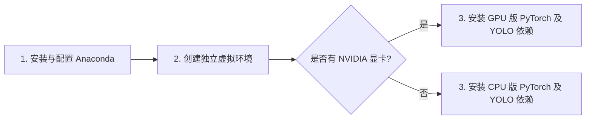
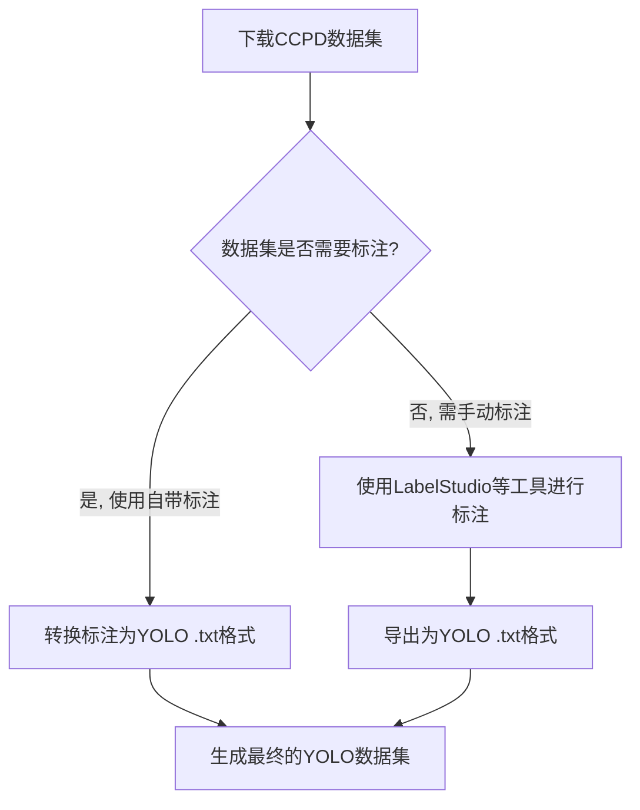
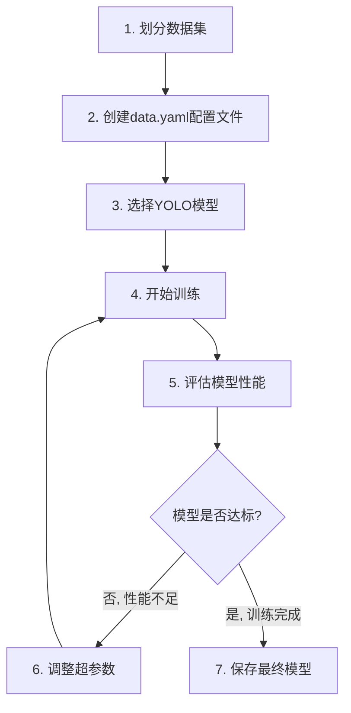
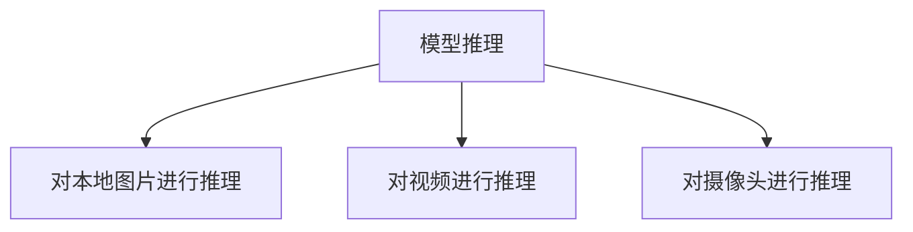
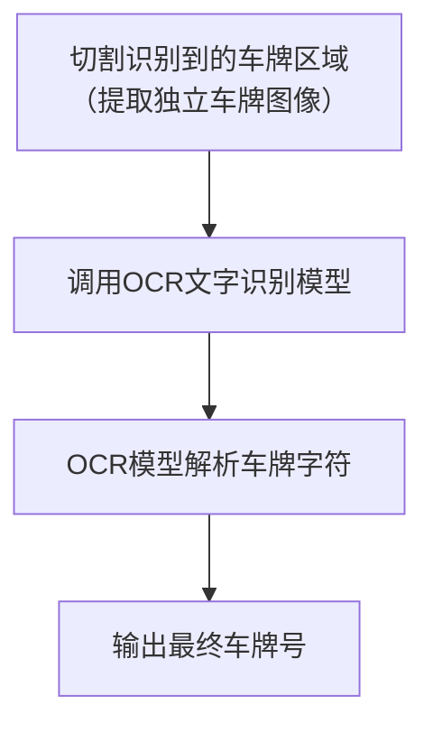

# 基于 YOLO 的车牌号识别系统

相信不少同学在入校时都注意到一个细节：校门口的升降杆门禁系统，能在车辆驶入的瞬间精准识别车牌号，随即完成放行操作。这一高效便捷的场景，正是人工智能在计算机视觉领域落地应用的典型体现。

车牌识别技术早已深度融入我们的日常生活。交通监控系统依靠它自动抓取违章车辆，为执法提供依据；在交通事故调查中，它更是快速锁定肇事车辆的关键。可以说，车牌识别技术就像车辆的“电子身份证”，是维护交通秩序与公共安全不可或缺的一环。

对于这项技术，你可能会有两种截然不同的看法：

- **觉得它高不可攀？** 刚接触“人工智能”或“神经网络”等概念的同学，可能会被其专业术语和对计算资源的要求所困扰，认为技术门槛太高，难以企及。
- **觉得它平淡无奇？** “不就是识别个车牌吗？”毕竟，用肉眼定位车牌、读取字符是件轻而易举的事。

无论你持何种观点，专业学习的价值就在于**打破认知壁垒，洞悉技术核心**。本次项目将带你深入了解“目标检测”技术，不仅会为你拆解车牌识别背后的完整逻辑，更将为你开启一扇通往信息工程领域的大门。

让我们从这个贴近生活的项目开始，一起探索更广阔的专业世界。

想要通过考核，你至少要完成 **Level 4**。

## Level 0：初识 YOLO（“You Only Look Once”）

提到目标检测，YOLO (You Only Look Once) 绝对是绕不开的经典模型。正如其名，“你只需看一眼”，YOLO 以其卓越的速度和精度，在学术界和工业界备受推崇。

### 参考文档：

YOLO官方文档：[主页 - Ultralytics YOLO 文档](https://docs.ultralytics.com/zh/)

YOLO github 链接：[GitHub - ultralytics/ultralytics: Ultralytics YOLO 🚀](https://github.com/ultralytics/ultralytics)

YOLO 相关论文汇总：[YOLOv1-v13各版本的作者（附论文及项目地址）_yolov10是谁创建的-CSDN博客](https://blog.csdn.net/qq_45464126/article/details/138159040)

## Level 1：配置YOLO环境

在正式开始之前，我们需要搭建一个稳定、独立的开发环境。由于不同项目可能依赖于不同版本的软件包（例如 Python，PyTorch），为了避免版本冲突，我们使用 Anaconda 来创建独立的虚拟环境。

在安装并配置好 Anaconda 后，我们就可以开始安装 YOLO 所需的依赖包了。根据你的电脑配置，可以选择安装支持 GPU 加速的 PyTorch 版本（如果你有 NVIDIA 显卡），或者选择仅使用 CPU 的版本。GPU 版本会大大加快模型训练和推理的速度，但 CPU 版本也完全可以完成项目，只是耗时稍长。

### 参考资料：

https://blog.csdn.net/excnies/article/details/147963523

https://blog.csdn.net/qq_59006308/article/details/139960548

https://blog.csdn.net/qlkaicx/article/details/134577555

## Level 2：下载和标注数据集

模型训练的基础是高质量的数据。我们将使用 CCPD (中国城市停车场数据集) 作为基础数据源。该数据集包含了大量真实场景下的车牌图片，分为 CCPD2019（蓝色车牌）和 CCPD2020（绿色新能源车牌）两个主要部分。

虽然 CCPD 数据集本身已经包含了标注信息，但了解数据标注流程是深度学习工程师的必备技能。我们可以使用 LabelStudio 等工具对自己的数据进行标注，并将其导出为 YOLO 支持的 .txt 格式。

数据集下载链接： https://pan.baidu.com/s/1-WmsMt7Zzx3jmLHVEYpdaw 提取码: 2111

### 参考资料：

CCPD 数据集处理（1）：[[深度学习\] CCPD车牌数据集介绍_ccpd数据集-CSDN博客](https://blog.csdn.net/LuohenYJ/article/details/117752120)

CCPD 数据集处理（2）：[CCPD车牌数据集转换成yolo训练格式_ccpd数据集转yolo格式-CSDN博客](https://blog.csdn.net/hyj6668/article/details/137028611)

数据集标注（这里如果你仔细研究了一下数据集，就可以省去标注的痛苦哦）：[标注工具——Label Studio安装与简单使用-CSDN博客](https://blog.csdn.net/m0_72915515/article/details/134248502)

## Level 3：划分数据集，配置并训练模型

有了数据和标签后，我们需要将数据集划分为**训练集 (Train)**、**验证集 (Validation)** 和**测试集 (Test)**。训练集用于训练模型参数，验证集用于在训练过程中评估模型表现并调整超参数，测试集则用于在训练完成后最终评估模型的泛化能力。

划分完毕后，我们还需要创建一个 .yaml 配置文件，告知 YOLO 框架数据集的路径、类别数量和类别名称等信息。一切准备就绪，就可以正式开始模型训练了！

**对于初次尝试，建议选择 YOLO 的 n (nano) 系列模型，如 yolov8n。这类模型体量小，对计算资源要求低，训练速度快，非常适合入门学习。**

### 参考资料：

数据集划分及`yaml`配置：[YOLO数据集目录划分方式及对应的data.yaml配置-CSDN博客](https://blog.csdn.net/m0_50037012/article/details/147097529)

训练模型：[使用 Ultralytics YOLO 进行模型训练 - Ultralytics YOLO 文档](https://docs.ultralytics.com/zh/modes/train/#usage-examples)

> [!NOTE]
>
> 建议选择`n`系列模型，模型小，需要算力少，训练时间短

## Level 4：使用训练好的模型进行推理

训练完成后，我们会在 `runs/train/exp/weights/`或者`runs/detect/train` 目录下找到训练好的模型权重文件（通常是 best.pt）。现在，我们可以使用这个模型对全新的图片、视频甚至实时摄像头画面进行目标检测，验证模型的实际效果。

**测试集下载:** [https://pan.baidu.com/s/1-WmsMt7Zzx3jmLHVEYpdaw](https://www.google.com/url?sa=E&q=https%3A%2F%2Fpan.baidu.com%2Fs%2F1-WmsMt7Zzx3jmLHVEYpdaw) (提取码: 2111)

> **加分项：** 尝试实现对视频文件或电脑摄像头的实时推理，这将让你的项目更具吸引力！

### 参考资料：

yolo 模型推理（1）：[使用 Ultralytics YOLO 进行模型预测 - Ultralytics YOLO 文档](https://docs.ultralytics.com/zh/modes/predict/#key-features-of-predict-mode)

yolo 模型推理（2）：[用训练好的模型在Yolov8上进行推理演示python代码，含图像检测，视频推理，实时摄像头检测。_yolov8测试视频的代码-CSDN博客](https://blog.csdn.net/TUSTer_/article/details/134716467)

## Level 5：结合 OCR 进行车牌字符识别

完成前面的步骤后，你会发现 YOLO 模型只能在图像中**定位**出车牌的位置，但并不能**读取**车牌上的具体字符。为了实现完整的车牌号识别，我们需要引入 **OCR (Optical Character Recognition, 光学字符识别)** 技术。

基本思路是：先用 YOLO 模型检测到车牌的边界框 (bounding box)，然后将这部分图像从原图中裁剪出来，最后将裁剪出的车牌图片送入一个专门的 OCR 模型（如 PaddleOCR）进行文字识别，从而得到最终的车牌号。

### 参考文档：

OCR：[什么是OCR - 知乎](https://zhuanlan.zhihu.com/p/144919420)

YOLO v8 + OCR：[yolov8与OCR结合使用_yolo+ocr-CSDN博客](https://blog.csdn.net/varda8899/article/details/147108041)

YOLO v11 + PaddleOCR：https://blog.csdn.net/ldlno/article/details/147252128

YOLO v11 + EasyOCR：https://blog.csdn.net/qq_42589613/article/details/144276341

## Level 6：实现图形化界面

为了让非技术人员也能方便地使用我们的模型，我们可以为其开发一个图形用户界面 (GUI)。通过 GUI，用户可以简单地通过点击按钮来上传图片或打开摄像头，并直观地看到识别结果。常用的 Python GUI 库有 PyQt6、PySide6、Tkinter 或其美化版 CustomTkinter。

实现视频流的实时推理并展示在 GUI 窗口中，将是对你综合编程能力的绝佳锻炼。