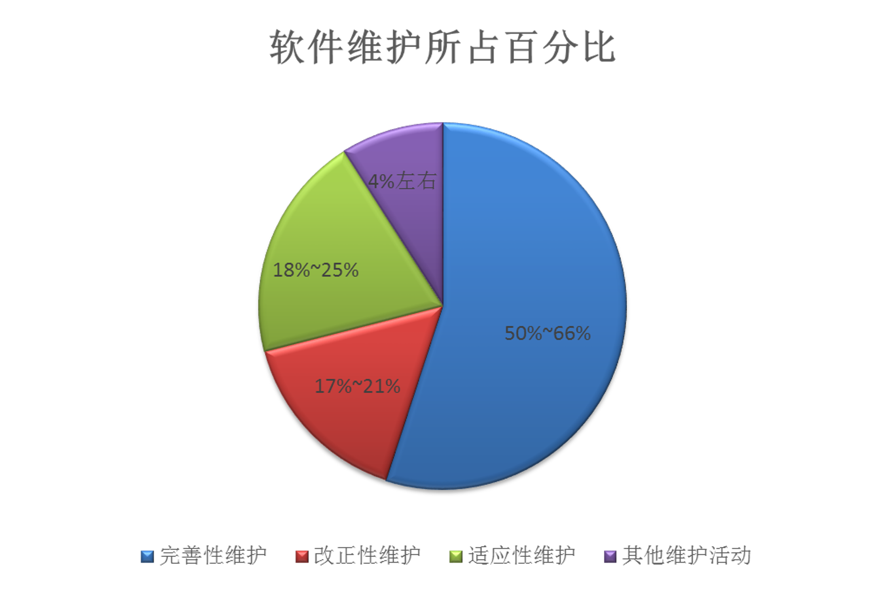
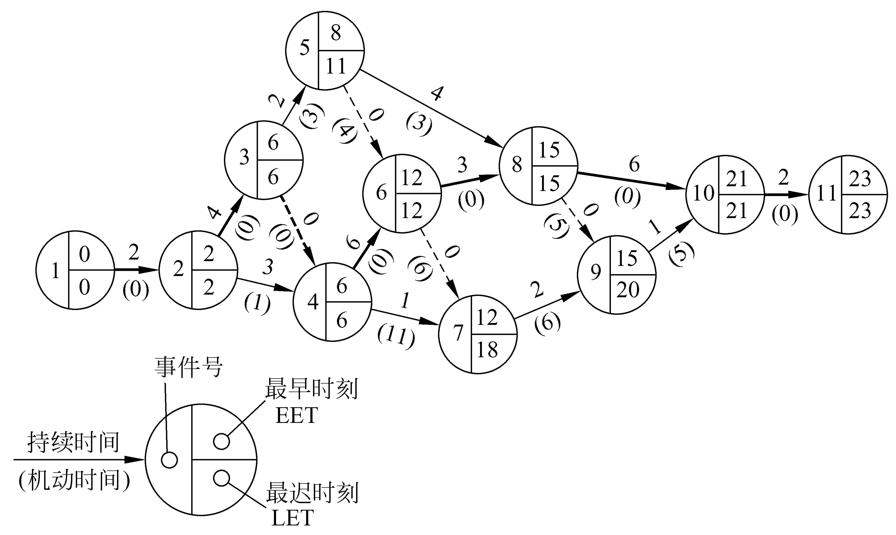

# 软件工程导论期末复习

## 第1章 软件工程学概述

### 1.1 软件危机

#### **软件危机的介绍**

- 软件危机是在计算机软件的开发和维护过程中所遇到的一系列严重问题。

#### **软件危机的典型表现**

- 对软件开发成本和进度的估计常常很不准确。
- 用户对“已完成的”软件系统不满意的现象经常发生。
- 软件产品的质量往往靠不住。
- 软件常常是不可维护的。
- 软件通常没有适当的文档资料。
- 软件成本在计算机系统总成本中所占的比例逐年上升。
- 软件开发生产率提高的速度，远远跟不上计算机应用迅速普及深入的趋势。

### 1.2 软件工程

#### **软件工程具有的本质特性**

- 软件工程关注于大型程序的构造
- 软件工程的中心课题是控制复杂性
- 软件经常变化
- 开发软件的效率非常重要
- 和谐地合作是开发软件的关键
- 必须有效地支持它的用户
- 两种背景的人创造产品这个特性与前两个特性紧密相关

#### **软件工程的基本原理**

- 1、用分阶段的生命周期计划严格管理

- 2、坚持进行阶段评审

- 3、实行严格的产品控制

- 4、采用现代程序设计技术

- 5、结果应能清楚地审查

- 6、开发小组的人员应该少而精

- 7、承认不断改进软件工程实践的必要性

#### 软件工程方法学

**方法**：完成软件开发的各项任务的技术方法，回答“怎样做”的问题

**工具**：为运用方法而提供的自动的或半自动的软件工程支撑环境

**过程**：为了获得高质量的软件所需要完成的一系列任务的框架，它规定了完成各项任务的工作步骤

### 1.3 软件生命周期

软件生命周期由软件定义、软件开发和运行维护(也称为软件维护)3个时期组成，每个时期又进一步划分成若干个阶段。

软件定义时期的任务是：确定软件开发工程必须完成的总目标；确定工程的可行性；导出实现工程目标应该采用的策略及系统必须完成的功能；估计完成该项工程需要的资源和成本，并且制定工程进度表。这个时期的工作通常又称为系统分析，由系统分析员负责完成。

### 1.4 软件过程

**常见软件工程模型**

- 瀑布模型
- 快速原型模型
- 增量模型
- 螺旋模型
- 喷泉模型
- Rational统一过程
- 敏捷过程与极限编程
- 微软过程

## 第2章 可行性研究

### 2.1 可行性研究的任务

#### 至少应该从下述3个方面研究每种解法的可行性：

- **技术可行性**：使用现有的技术能实现这个系统吗?
- **经济可行性**：这个系统的经济效益能超过它的开发成本吗?
- **操作可行性**：系统的操作方式在这个用户组织内行得通吗?

### 2.5 数据字典

#### **定义数据的方法**

**由数据元素组成数据的方式只有下述3种基本类型：**

- **顺序**：即以确定次序连接两个或多个分量。
- **选择**：即从两个或多个可能的元素中选取一个。
- **重复**：即把指定的分量重复零次或多次。

#### 第4种关系算符：

- `=` 意思是等价于(或定义为)；
- `+` 意思是和(即连接两个分量)；
- `［］` 意思是或(即从方括弧内列出的若干个分量中选择一个)，通常用“|”号隔开供选择的分量；
- `{}` 意思是重复(即重复花括弧内的分量)；
- `()` 意思是可选(即圆括弧里的分量可有可无)。

#### 数据字典的用途

- 数据字典最重要的用途是作为分析阶段的工具
- 数据字典中包含的每个数据元素的控制信息是很有价值的
- 数据字典是开发数据库的第一步，而且是很有价值的一步。

### 2.6 成本/效益分析

#### **成本估计**

软件开发成本主要表现为人力消耗(乘以平均工资则得到开发费用)。成本估计不是精确的科学，因此应该使用几种不同的估计技术以便相互校验。

下面简单介绍3种估算技术：
- 代码行技术
- 任务分解技术
- 自动估计成本技术

## 第3章 需求分析

#### **引言**

尽管目前有许多不同的用于需求分析的结构化分析方法，但是，所有这些分析方法都遵守一些准则。

- 必须理解并描述向题的信息域，根据这条准则应该建立数据模型
- 必须定义软件应完成的功能，这条准则要求建立功能模型。
- 必须描述作为外部事件结果的软件行为，这条准则要求建立行为模型
- 必须对描述信息、功能和行为的模型进行分解用层次的方式展示细节。

### 3.3 分析建模与规格说明

#### **分析建模**

需求分析过程应该建立3种模型，它们分别是数据模型 、功能模型、 行为模型。

- 实体联系图，描绘数据对象及数据对象之间的关系，是用于建立数据模型的图形。
- 数据流图是建立功能模型的基础。
- 状态转换图描绘了系统的各种行为模式和在不同状态间转换的方式。

### 3.4 实体联系图

数据模型中包含3种相互关联的信息：数据对象、数据对象的属性及数据对象彼此间相互连接的关系。

ER图中包含了实体(即数据对象)、关系和属性3种基本成分，通常用矩形框代表实体，用连接相关实体的菱形框表示关系，用椭圆形或圆角矩形表示实体(或关系)的属性，并用直线把实体(或关系)与其属性连接起来。

### 3.8 验证软件需求

#### **从哪些方面验证软件需求的正确性**

为了提高软件质量，确保软件开发成功，降低软件开发成本，一旦对目标系统提出一组要求之后，必须严格验证这些需求的正确性。一般说来，应该从下述4个方面进行验证。
- 一致性
- 完整性
- 现实性
- 有效性

## 第4章 形式化说明技术

### 4.1 概述

按照形式化程度，可以把软件工程使用的方法划分为非形式化、半形式化和形式化3类。

#### **基于数学的形式化方法的优点**

1. 数学能够简洁准确地描述物理现象、对象或动作的结果，因此是理想的建模工具。
2. 可以在不同的软件工程活动之间平滑地过渡。
3. 数学提供了高层确认的手段。

## 第5章 总体设计

### 5.2 设计原理

#### **抽象与求精**

- 求精实际上是细化过程。
- 抽象与求精是一对互补的概念。

#### **耦合**

模块耦合分为数据耦合、控制耦合、特征耦合、公共环境耦合和内容耦合。

- 数据耦合是低耦合。系统中至少必须存在这种耦合。
- 最高程度的耦合是内容耦合。

#### **内聚**

内聚分为三大类低内聚、中内聚和高内聚。

- **低内聚**
  - 偶然内聚
  - 逻辑内聚
  - 时间内聚
- **高内聚**
  - 顺序内聚
  - 功能内聚是最高程度的内聚。

### 5.3 启发规则

1. 改进软件结构提高模块独立性
2. 模块规模应该适中
3. 深度、宽度、扇出和扇入都应适当
4. 模块的作用域应该在控制域之内
5. 力争降低模块接口的复杂程度
6. 设计单入口单出口的模块
7. 模块功能应该可以预测

## 第6章 详细设计

### 6.3 过程设计的工具

#### **程序流程图**

程序流程图又称为程序框图，是使用最广泛的描述过程设计的方法。

使用的符号包括：(a) 选择(分支)； (b) 注释； (c) 预先定义的处理； (d) 多分支； (e) 开始或停止； (f) 准备； (g) 循环上界限； (h) 循环下界限； (i) 虚线； (j) 省略符； (k) 并行方式； (l) 处理； (m) 输入输出； (n) 连接； (o) 换页连接； (p) 控制流。

#### **盒图**

图中给出了结构化控制结构的盒图表示，也给出了调用子程序的盒图表示方法。

#### 判定表

|          | 1 | 2 | 3 | 4 | 5 | 6 | 7 | 8 | 9 |
|----------|---|---|---|---|---|---|---|---|---|
| 国内乘客   |   | T | T | T | T | F | F | F | F |
| 头等舱    |   | T | F | T | F | T | F | T | F |
| 残疾乘客   |   | F | F | T | T | F | F | T | T |
| 行李重量W≤30kg | T | F | F | F | F | F | F | F | F |
| 免费      | X |   |   |   |   |   |   |   |   |
| (W-30)×2 |   |   |   | X |   |   |   |   |   |
| (W-30)×3 |   |   |   |   | X |   |   |   |   |
| (W-30)×4 |   | X |   |   |   |   |   | X |   |
| (W-30)×6 |   |   | X |   |   |   |   |   | X |
| (W-30)×8 |   |   |   |   |   | X |   |   |   |
| (W-30)×12 |   |   |   |   |   |   | X |   |   |

#### **判定树**

判定树是判定表的变种，它也能清晰地表示复杂的条件组合与应做的动作之间的对应关系。

## 第7章 实现

### **引言**

**编码**：编码就是把软件设计结果翻译成用某种程序设计语言书写的程序，是对设计的进一步具体化。

**测试**：程序的质量主要取决于软件设计的质量。软件测试是保证软件质量的关键步骤，是对软件规格说明、设计和编码的最后复审。

### 7.1 编码

#### **选择程序设计语言**

程序设计语言是人和计算机通信的最基本的工具，会影响人的思维和解题方式，影响人和计算机通信的方式和质量，影响其他人阅读和理解程序的难易程度。

选择适宜的程序设计语言的原因：
- 根据设计去完成编码时，困难最少；
- 可以减少需要的程序测试量；
- 可以得到更容易阅读和更容易维护的程序。

### 7.2 软件测试基础

#### **软件测试准则（主要的测试准则）**

1.所有测试都应该能追溯到用户需求。正如上一小节讲过的，软件测试的目标是发现错误。从用户的角度看，最严重的错误是导致程序不能满足用户需求的那些错误。

2.应该远在测试开始之前就制定出测试计划。实际上，一旦完成了需求模型就可以着手制定测试计划，在建立了设计模型之后就可以立即开始设计详细的测试方案。因此，在编码之前就可以对所有测试工作进行计划和设计。

3.把Pareto原理应用到软件测试中。Pareto原理说明，测试发现的错误中的80%很可能是由程序中20%的模块造成的。当然，问题是怎样找出这些可疑的模块并彻底地测试它们。

4.应该从“小规模”测试开始，并逐步进行“大规模”测试。通常，首先重点测试单个程序模块，然后把测试重点转向在集成的模块簇中寻找错误，最后在整个系统中寻找错误。

5.穷举测试是不可能的。所谓穷举测试就是把程序所有可能的执行路径都检查一遍的测试。即使是一个中等规模的程序，其执行路径的排列数也十分庞大，由于受时间、人力和资源的限制，在测试过程中不可能执行每个可能的路径。因此，测试只能证明程序中有错误，不能证明程序中没有错误。但是，精心地设计测试方案，有可能充分覆盖程序逻辑并使程序达到所要求的可靠性。

6.为了达到最佳的测试效果，应该由独立的第三方从事测试工作。所谓“最佳效果”是指有最大可能性发现错误的测试。由于前面已经讲过的原因，开发软件的软件工程师并不是完成全部测试工作的最佳人选（通常他们主要承担模块测试工作）。

### 7.3 单元测试

#### **测试重点**

在单元测试期间着重从以下5个方面对模块进行测试：
- 模块接口
- 局部数据结构
- 重要的执行通路
- 出错处理通路
- 边界条件

#### **代码审查**

**代码检查**是指由审查小组正式对源程序进行人工测试。它是一种非常有效的程序验证技术，对于典型的程序来说，可以查出30%～70%的逻辑设计错误和编码错误。审查小组最好由下述4人组成。

- 组长，应该是一个很有能力的程序员，而且没有直接参与这项工程；
- 程序的设计者；
- 程序的编写者；
- 程序的测试者。

### 7.6 白盒测试技术

- 设计测试方案是测试阶段的关键问题。
- 所谓测试方案包括：
  - 具体的测试目的
  - 应该输入的测试数据
  - 预期的测试结果
- 通常把测试数据和预期的输出结果称为测试用例。
- 其中最困难的问题就是设计测试用的输入数据。

#### **逻辑覆盖**

- **语句覆盖**：选择足够的测试用例，使得程序中每一条可执行语句至少被执行一次。
- **判定覆盖**：选择足够的测试用例，使得程序中每一个分支判断的每一种可能结果(主要指switch-case情况)都至少被执行一次。也叫分支覆盖。
- **条件覆盖**：选择足够的测试用例，使得程序中每一个分支判断中的每一个条件的可能结果都至少被执行一次。
- **判定/条件覆盖**：选择足够的测试用例，使得同时满足判定覆盖和条件覆盖。
- **条件组合覆盖**：选择足够的测试用例，使得程序中每一个分支判断中的每一个条件的每一种可能组合结果都至少被执行一次。
- **路径覆盖**：选择足够的测试用例，使得程序中所有的可能路径都至少被执行一次。

### 7.7 黑盒测试技术

#### **等价划分**

分析程序的规格说明，可以划分出等价类。

- **有效输入的等价类**：
  1. 1～6个数字字符组成的数字串(最高位数字不是零)。
  2. 最高位数字是零的数字串。
  3. 最高位数字左邻是负号的数字串。

- **无效输入的等价类**：

  1. 空字符串(全是空格)。
  2. 左部填充的字符既不是零也不是空格。
  3. 最高位数字右面由数字和空格混合组成。
  4. 最高位数字右面由数字和其他字符混合组成。
  5. 负号与最高位数字之间有空格。

- **合法输出的等价类**：

  1. 在计算机能表示的最小负整数和零之间的负整数。
  2. 零。
  3. 在零和计算机能表示的最大正整数之间的正整数。

- **非法输出的等价类**：

  1. 比计算机能表示的最小负整数还小的负整数。
  2. 比计算机能表示的最大正整数还大的正整数。

计算机字长16位，用二进制补码表示整数，能表示的最小负整数是-32768，最大正整数是32767。

根据划分出的等价类设计的测试方案：

| 编号 | 描述 | 输入 | 预期输出 |
|--- |--- |--- |--- |
| 1 | 1～6个数字组成的数字串，输出是合法的正整数 | ‘1’ | 1 |
| 2 | 最高位数字是零的数字串，输出是合法的正整数 | ‘000001’ | 1 |
| 3 | 负号与最高位数字紧相邻，输出合法的负整数 | ‘-00001’ | -1 |
| 4 | 最高位数字是零，输出也是零 | ‘000000’ | 0 |
| 5 | 太小的负整数 | ‘-47561’ | 错误——无效输入 |
| 6 | 太大的正整数 | ‘132767’ | 错误——无效输入 |
| 7 | 空字符串 | ‘ ’ | 错误——没有数字 |
| 8 | 字符串左部字符既不是零也不是空格 | ‘×××××1’ | 错误——填充错 |
| 9 | 最高位数字后面有空格 | ‘1 2’ | 错误——无效输入 |
| 10 | 最高位数字后面有其他字符 | ‘1××2’ | 错误——无效输入 |
| 11 | 负号和最高位数字之间有空格 | ‘- 12’ | 错误——负号位置错 |

### 7.8 调试

#### **调试途径**

1. 蛮干法
2. 回溯法
3. 原因排错法：对分查找法、归纳法和演绎法都属于原因排除法。

### 7.9 软件可靠性

#### **估算平均无故障时间的方法**

##### **符号**：

- $E_T$——测试之前程序中错误总数；
- $I_T$——程序长度(机器指令总数)；
- $τ$——测试(包括调试)时间；
- $E_d(τ)$——在0至$\tau$期间发现的错误数；
- $E_c(τ)$——在0至$\tau$期间改正的错误数。

##### **基本假定**：

1. 在类似的程序中，单位长度里的错误数 $E_T/I_T$ 近似为常数。美国的一些统计数字表明，通常 $0.5×10^{−2}≤E_T/I_T≤2×10^{−2}$。
2. 失效率正比于软件中剩余的(潜藏的)错误数，而平均无故障时间MTTF与剩余的错误数成反比。
3. 假设发现的每一个错误都立即正确地改正了(即调试过程没有引入新的错误)。因此，$E_c(τ)=E_d(τ)$。剩余的错误数为$E_r(τ)=E_T−E_c(τ)$，单位长度程序中剩余的错误数为 $ϵ_r(τ)=E_T/I_T−E_c(τ)/I_T$。

##### **估算平均无故障时间**

- 经验表明，平均无故障时间与单位长度程序中剩余的错误数成反比，即：$MTTF=\frac{1}{E_T/I_T−E_c(τ)/I_T}$

- 其中，$K$为常数，它的值应该根据经验选取。美国的一些统计数字表明，$K$的典型值是200。

##### **估计错误总数的方法**

**植入错误法**

在测试之前由专人在程序中随机地植入一些错误，测试之后，根据测试小组发现的错误中原有的和植入的两种错误的比例，来估计程序中原有错误的总数ET。

假设人为地植入的错误数为 $N_s$ ，经过一段时间的测试之后发现 $n_s$ 个植入的错误，此外还发现了 $n$ 个原有的错误。如果可以认为测试方案发现植入错误和发现原有错误的能力相同，则能够估计出程序中原有错误的总数为：$\hat{N}=\frac{n}{n_s}N_s$

其中, $\hat{N}$ 即是错误总数ET的估计值。

**分别测试法**

为了随机地给一部分错误加标记，**分别测试法**使用两个测试员(或测试小组)，彼此独立地测试同一个程序的两个副本，把其中一个测试员发现的错误作为有标记的错误。**具体做法**是，在测试过程的早期阶段，由测试员甲和测试员乙分别测试同一个程序的两个副本，由另一名分析员分析他们的测试结果。用**τ**表示测试时间，假设

- $τ=0$时错误总数为 $B_0$；
- $τ=τ_1$ 时测试员甲发现的错误数为 $B_1$；
- $τ=τ_1$ 时测试员乙发现的错误数为 $B_2$；
- $τ=τ_1$ 时两个测试员发现的相同错误数为 $b_c$​。

如果认为测试员甲发现的错误是有标记的，即程序中有标记的错误总数为$B_1$，则测试员乙发现的$B_2$个错误中有$b_c$个是有标记的假定测试员乙发现有标记错误和发现无标记错误的概率相同，则可以估计出测试前程序中的错误总数为：$\hat{B}_0=\frac{B_2}{b_c}B_1$

使用分别测试法，在测试阶段的早期，每隔一段时间分析员分析两名测试员的测试结果，并且使用上面的公式计算$\hat{B}_0$。。如果几次估算的结果相差不多，则可用B的平均值作为$E_T$的估计值。

## 第8章 维护

### 8.1 软件维护的定义

4项活动：

- 改正性维护 (17%~21%)
- 适应性维护 (18%~25%)
- 完善性维护 (50%~66%)
- 预防性维护 (4%左右)

在全部维护活动中一半以上是完善性维护。

### 8.3 软件维护的过程

#### **维护过程的本质**

维护过程本质上是修改和压缩了的软件定义和开发过程，而且事实上远在提出一项维护要求之前，与软件维护有关的工作已经开始了。

- 首先必须建立一个维护组织。
- 随后必须确定报告和评价的过程。
- 而且必须为每个维护要求规定一个标准化的事件序列。

此外，还应该建立一个适用于维护活动的记录保管过程，并且规定复审标准。

### 8.4 软件的可维护性

可以把软件的可维护性定性地定义为：维护人员理解、改正、改动或改进这个软件的难易程度。

决定软件可维护性的因素主要有下述5个：
1. 可理解性
2. 可测试性
3. 可修改性
4. 可移植性
5. 可重用性

## 第13章 软件项目管理

### 13.1 估算软件规模

#### **代码行技术**

**代码行技术的主要优点：**

1. 代码是所有软件开发项目都有的“产品”；
2. 而且很容易计算代码行数。

**代码行技术的缺点是**：

1. 源程序仅是软件配置的一个成分，用它的规模代表整个软件的规模似乎不太合理；
2. 用不同语言实现同一个软件所需要的代码行数并不相同；
3. 这种方法不适用于非过程语言。

### 13.2 工作量估算

软件估算模型使用由经验导出的公式来预测软件开发工作量，工作量是软件规模（KLOC或FP）的函数，工作量的单位通常是人月（pm)。

支持大多数估算模型的经验数据，都是从有限个项目的样本集中总结出来的，因此，没有一个估算模型可以适用于所有类型的软件和开发环境。

**模型分类：**

- 静态单变量模型
- 动态多变量模型
- COCOMO2 模型

### 13.3 进度计划

#### **估算工程进度**

图13.3展示了一个工程进度图，其中包含了事件号、持续时间(机动时间)、最早时刻(EET)和最迟时刻(LET)等元素。

### 13.4 人员组织

#### **民主制程序员组**

- 主要优点是，组员们对发现程序错误持积极的态度，这种态度有助于更快速地发现错误，从而导致高质量的代码。
- 另一个优点是，组员们享有充分民主，小组有高度凝聚力，组内学术空气浓厚，有利于攻克技术难关。

### 13.5 质量保证

#### **软件质量保证措施**

软件质量保证（SQA）的措施主要有：基于非执行的测试（也称为复审或评审），基于执行的测试（即以前讲过的软件测试）和程序正确性证明。

正式技术复审是软件质量保证措施的一种，包括走查（walkthrough)和审查（inspection）等具体方法。走查的步骤比审查少，而且没有审查正规。

### 13.6 软件配置管理

#### **软件配置**

**软件配置项**

软件过程的输出信息可以分为3类：

（1）计算机程序（源代码和可执行程序）。

（2）描述计算机程序的文档（供技术人员或用户使用）。

（3） 数据（程序内包含的或在程序外的）。

具体来说，软件配置管理主要有5项任务： 标识、版本控制、变化控制、配置审计和报告。