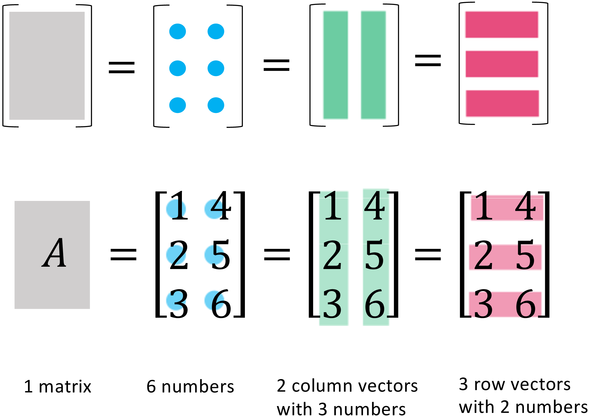
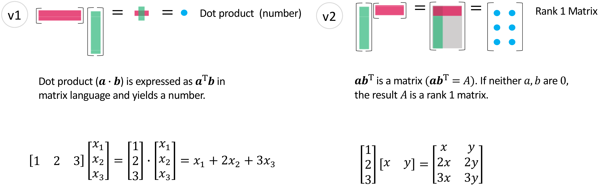
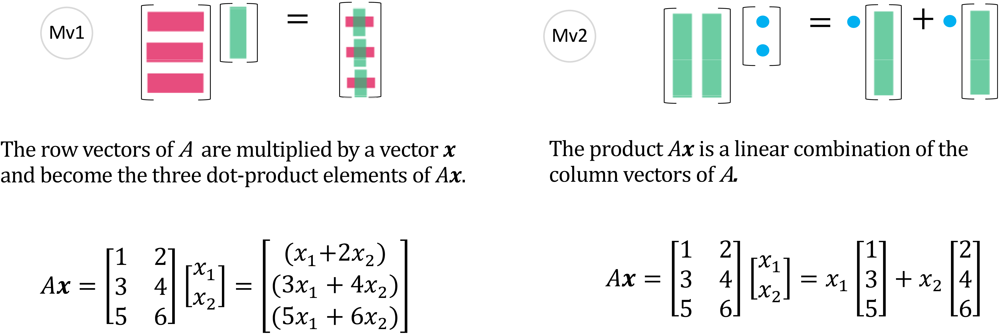
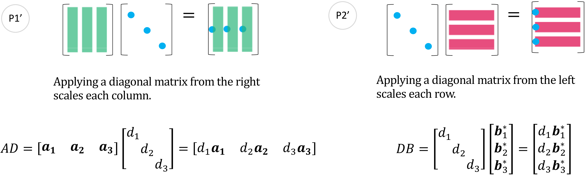
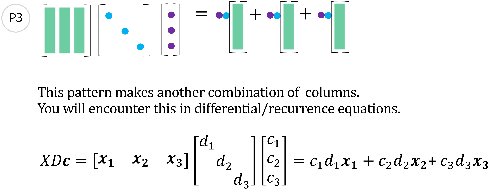
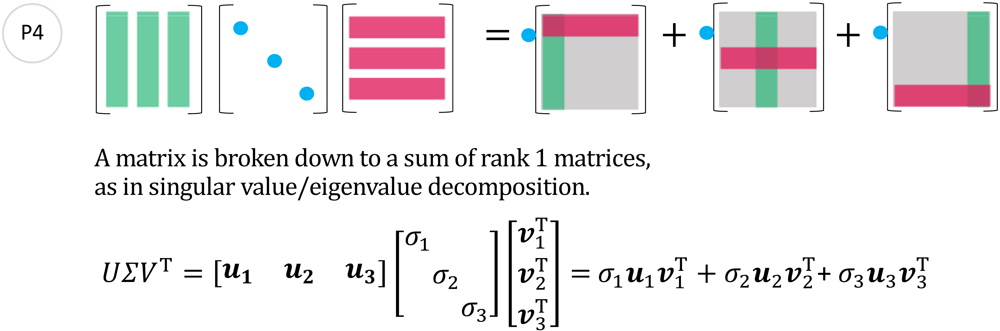
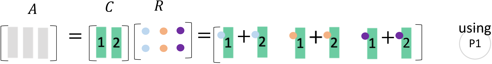
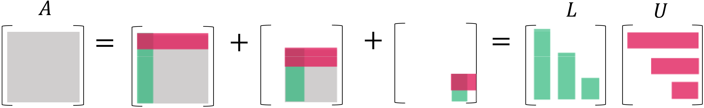
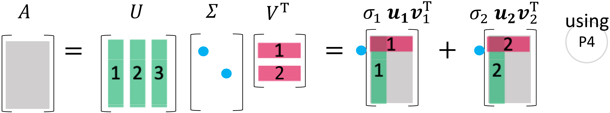

# The Art of Linear Algebra
#### -- Graphic Notes on “Linear Algebra for Everyone" --

**作者:** Kenji Hiranabe [^author1]

在 Gilbert Strang [^author2] 的亲切帮助下

**译者:** Kefang Liu [^author3]

**日期:** September 1, 2021/updated today

## 摘要

我尝试为 Gilbert Strang 在书籍 “Linear Algebra for Everyone” 中介绍的矩阵的重要概念进行可视化图释, 以促进从矩阵分解的角度对向量、矩阵计算和算法的理解。[^footnote1]它们包括矩阵分解 (Column-Row, $\boldsymbol{CR}$)、高斯消去法 (Gaussian Elimination, $\boldsymbol{LU}$)、格拉姆-施密特正交化 (Gram-Schmidt Orthogonalization, $\boldsymbol{QR}$)、特征值和对角化 (Eigenvalues and Diagonalization, $\boldsymbol{Q \Lambda Q^\mathrm{T}}$)、和奇异值分解 (Singular Value Decomposition, $\boldsymbol{U \Sigma V^\mathrm{T}}$)。

## 序言
我很高兴能看到 Kenji Hiranabe 的线性代数中的矩阵运算的图片! 这样的图片是展示代数的绝佳方式. 我们当然可以通过 行 $\boldsymbol{\cdot}$ 列 的点乘来想象矩阵乘法, 但那绝非全部 —— 它是“线性组合”与“秩1矩阵”组成的代数与艺术. 我很感激能看到日文翻译的书籍和 Kenji 的图片中的想法. 

-- Gilbert Strang

麻省理工学院数学教授

## 目录

[TOC]

---

## 1、理解矩阵——4个视角

一个矩阵 ($m \times n$) 可以被视为$1$个矩阵, $mn$个数, $n$个列和$m$个行。

*
图 1: 从四个角度理解矩阵
*

$$
A= \begin{bmatrix}
    a_{11} & a_{12}\\
    a_{21} & a_{22}\\
    a_{31} & a_{32}
  \end{bmatrix}
  =
  \begin{bmatrix}
    | & |\\
    \boldsymbol{a_1} & \boldsymbol{a_2}\\
    | & |
  \end{bmatrix}
  =
  \begin{bmatrix}
    - \boldsymbol{a_1^*} -\\
    - \boldsymbol{a_2^*} -\\
    - \boldsymbol{a_3^*} -
  \end{bmatrix}
$$

在这里, 列向量被标记为粗体$\boldsymbol{a_1}$。行向量则有一个$\boldsymbol{*}$号, 标记为$\boldsymbol{a_1^*}$。转置向量和矩阵则用$\mathrm{T}$标记为$\boldsymbol{a}^\mathrm{T}$和$A^\mathrm{T}$。

## 2、向量乘以向量——2个视角

后文中, 我将介绍一些概念, 同时列出“Linear Algebra for Everyone”一书中的相应部分 (部分编号插入如下)。详细的内容最好看书, 这里我也添加了一个简短的解释, 以便您可以通过这篇文章尽可能多地理解。

此外, 每个图都有一个简短的名称, 例如 v1 (数字 1 表示向量的乘积)、Mv1 (数字 1 表示矩阵和向量的乘积), 以及如下图 (v1) 所示的彩色圆圈。
如你所见, 随着讨论的进行, 该名称将被交叉引用。

- 1.1节 (p.2) Linear combination and dot products
- 1.3节 (p.25) Matrix of Rank One
- 1.4节 (p.29) Row way and column way

*
图 2: 向量乘以向量 - (v1), (v2)
*

(v1) 是两个向量之间的基础运算, 而 (v2) 将列乘以行并产生一个秩1矩阵。理解 (v2) 的结果 (秩1) 是接下来章节的关键。

## 3、矩阵乘以向量——2个视角

一个矩阵乘以一个向量将产生三个点积组成的向量 (Mv1) 和一种$A$的列向量的线性组合。

- 1.1节 (p.3) Linear combinations
- 1.3节 (p.21) Matrices and Column Spaces

*
图 3: 矩阵乘以向量- (Mv1), (Mv2)
*

往往你会先学习 (Mv1). 但当你习惯了从 (Mv2) 的视角看待它, 会理解$A\boldsymbol{x}$是$A$的列的线性组合。矩阵$A$的列向量的所有线性组合生成的子空间记为$\boldsymbol{C}(A)$。$A\boldsymbol{x}=\boldsymbol{0}$的解空间则是零空间, 记为$\boldsymbol{N}(A)$。

同理, 由 (vM1) 和 (vM2) 可见, 行向量乘以矩阵也是同一种理解方式。

*
图 4: 向量乘以矩阵 - (vM1), (vM2)
*

上图$A$的行向量的所有线性组合生成的子空间记为$\boldsymbol{C}(A^\mathrm{T})$。$yA=0$的解空间是$A$的左零空间, 记为 $\boldsymbol{N}(A^\mathrm{T})$。

本书的一大亮点即为四个基本子空间: 在$\mathbb{R}^n$ 上的$\boldsymbol{N}(A)$ + $\boldsymbol{C}(A^\mathrm{T})$ (相互正交) 和在$\mathbb{R}^m$ 上的$\boldsymbol{N}(A^\mathrm{T})$ + $\boldsymbol{C}(A)$ (相互正交)。

- 3.5节 (p.124) Dimensions of the Four Subspaces

*
图 5: 四个子空间
*

关于秩$r$, 请见$A=CR$ (6.1节)。

## 4、矩阵乘以矩阵——4个视角

由``矩阵乘以向量"自然延伸到``矩阵乘以矩阵"。

- 1.4节 (p.35) Four ways to multiply $\boldsymbol{AB=C}$
- 也可以见书的封底

*
图 6: 矩阵乘以矩阵 - (MM1), (MM2), (MM3), (MM4)
*

## 5、实用模式

在这里, 我展示了一些实用的模式, 可以让你更直观地理解接下来的内容。

*
图 7: 图 1, 2 - (P1), (P1)
*

P1 是 (MM2) 和 (Mv2) 的结合。P2 是 (MM3) 和 (vM2) 的扩展。注意, P1 是列运算 (右乘一个矩阵), 而 P2 是行运算 (左乘一个矩阵)。

*
图 8: 图 1′, 2′ - (P1′), (P2′)
*

(P1′) 将对角线上的数乘以矩阵的列, 而 (P2′) 将对角线上的数乘以矩阵的行。两个分别为 (P1) 和 (P2) 的变体。

*
图 9: 图 3 - (P3)
*

当解决微分方程和递归方程时的也会出现这一模式: 

- 6节 (p.201) Eigenvalues and Eigenvectors
- 6.4节 (p.243) Systems of Differential Equations

$$
\begin{aligned}
  \frac{d \boldsymbol{u}(t) }{dt} &= A \boldsymbol{u}(t), \quad \boldsymbol{u}(0)=\boldsymbol{u}_0\\
  \boldsymbol{u}_{n+1} &= A \boldsymbol{u}_n, \quad \boldsymbol{u_0} = \boldsymbol{u}_0
\end{aligned}
$$

在两种问题中, 它的解都可以用$A$的特征值($\lambda_1, \lambda_2, \lambda_3$)、特征向量$X=\begin{bmatrix} \boldsymbol{x}_1 & \boldsymbol{x}_2 & \boldsymbol{x}_3 \end{bmatrix}$和系数$c=\begin{bmatrix} c_1 & c_2 & c_3 \end{bmatrix}^\mathrm{T}$表示。其中$C$是以$X$为基底的初始值$\boldsymbol{u}(0)=\boldsymbol{u}_0$的坐标。

$$
\boldsymbol{u}_0 = c_1 \boldsymbol{x}_1 + c_2 \boldsymbol{x}_2 + c_3 \boldsymbol{x}_3
$$

$$
\boldsymbol{c} =
  \begin{bmatrix}
    c_1\\
    c_2\\
    c_3
  \end{bmatrix} = X^{-1} \boldsymbol{u}_0
$$

以上两个问题的通解为:

$$
\begin{aligned}
  \boldsymbol{u}(t) &= e^{At} \boldsymbol{u}_0 = X e^{\Lambda t} X^{-1} \boldsymbol{u_0} &= X e^{\Lambda t} \boldsymbol{c} &= c_1 e^{\lambda_1 t} \boldsymbol{x}_1 + c_2 e^{\lambda_2 t} \boldsymbol{x}_2 + c_3 e^{\lambda_3 t} \boldsymbol{x}_3\\
  \boldsymbol{u}_n &= A^n \boldsymbol{u}_0 = X \Lambda^n X^{-1} \boldsymbol{u_0} &= X \Lambda^n \boldsymbol{c} &= c_1 \lambda_1^n \boldsymbol{x}_1 + c_2 \lambda_2^n \boldsymbol{x}_2 + c_3 \lambda_3^n \boldsymbol{x}_3
\end{aligned}
$$

见图 9: 通过P3可以得到$XDc$​。

*
图 10: Pattern 4 - (P4)
*

P4在特征值分解和特异值分解中都会用到。两种分解都可以表示为三个矩阵之积, 其中中间的矩阵均为对角矩阵。且都可以表示为带特征值/特异值系数的秩1矩阵之积。

更多细节将在下一节中讨论。

## 6、矩阵的五种分解

- 前言 p.vii, The Plan for the Book.

$A=CR, A=LU, A=QR, A=Q \Lambda Q^\mathrm{T}, A=U \Sigma V^\mathrm{T}$ 将一一说明。

| 分解                                       |                         图示                         | 说明                                                         |
| :----------------------------------------- | :--------------------------------------------------: | :----------------------------------------------------------- |
| **$\boldsymbol{A=CR}$**                    |      | $C$为$A$的线性无关列 $R$为$A$的行阶梯形矩阵 可推知 列秩 = 行秩 |
| **$\boldsymbol{A=LU}$**                    |      | $LU$分解通过 高斯消去法 (下三角)(上三角)               |
| **$\boldsymbol{A=QR}$**                    |      | $QR$分解为 格拉姆-施密特正交化中的 正交矩阵$Q$和三角矩阵$R$ |
| **$\boldsymbol{S=Q\Lambda Q^\mathrm{T}}$** |  | 对称矩阵$S$可以进行 特征值分解 特征向量组成$Q$, 特征值组成$\Lambda$ |
| **$\boldsymbol{A=U\Sigma V^\mathrm{T}}$**  |  | 所有矩阵$A$的 奇异值分解  奇异值组成$\Sigma$           |

*
表 1: 五种分解
*

### 6.1 $\boldsymbol{A=CR}$

- 1.4节 Matrix Multiplication and $\boldsymbol{A=CR}$ (p.29)

所有一般的长矩阵$A$都有相同的行秩和列秩。这个分解是理解这一定理最直观的方法。$C$由$A$的线性无关列组成, $R$为$A$的行阶梯形矩阵 (消除了零行)。$A=CR$将$A$化简为$r$的线性无关列$C$和线性无关行$R$的乘积。

$$
\begin{aligned}
    A &= CR\\
  \begin{bmatrix}
    1 & 2 & 3 \\
    2 & 3 & 5
  \end{bmatrix}
  & =
  \begin{bmatrix}
    1 & 2 \\
    2 & 3
  \end{bmatrix}
  \begin{bmatrix}
    1 & 0 & 1 \\
    0 & 1 & 1
  \end{bmatrix}
\end{aligned}
$$

推导过程: 从左往右看$A$的列. 保留其中线性无关的列, 去掉可以由前者线性表出的列。则第1、2列被保留, 而第三列因为可以由前两列之和表示而被去掉。而要通过线性无关的1、2两列重新构造出$A$, 需要右乘一个行阶梯矩阵$R$。

*
图 11: CR中列的秩
*

现在你会发现列的秩为2, 因为$C$中只有2个线性无关列。而$A$中所有的列都可以由$C$中的2列线性表出。

*
图 12: CR中行的秩
*

同样, 行秩也为2, 因为$R$中只有2个线性无关行, 且$A$中所有的行都可以由$R$中的2行线性表出。

### 6.2 $\boldsymbol{A=LU}$

用高斯消除法求解$A\boldsymbol{x}=\boldsymbol{b}$也被称为$LU$分解。通常, 是$A$左乘一个初等行变换矩阵($E$)来得到一个上三角矩阵$U$。

$$
\begin{aligned}
  EA &= U\\
  A &= E^{-1}U\\
\text{let} \; L = E^{-1}, \quad  A &= LU
\end{aligned}
$$

现在, 求解$A\boldsymbol{x}=\boldsymbol{b}$有2步: (1)求解$L\boldsymbol{c}=\boldsymbol{b}$, (2)代回$U\boldsymbol{x}=\boldsymbol{c}$。

- 2.3节 (p.57) Matrix Computations and $\boldsymbol{A=LU}$

在这里, 我们直接通过$A$计算$L$和$U$。

$$
A = 
      \begin{bmatrix}
        |\\
        \boldsymbol{l}_1\\
        |
      \end{bmatrix}
      \begin{bmatrix}
        -  \boldsymbol{u}^*_1  -
      \end{bmatrix}
  +  \begin{bmatrix}
      0 & \begin{matrix} 0 & 0 \end{matrix}\\
      \begin{matrix} 0 \\ 0 \end{matrix} & A_2
    \end{bmatrix}
  = 
  \begin{bmatrix}
    |\\
    \boldsymbol{l}_1\\
    |
  \end{bmatrix}
  \begin{bmatrix}
    - \boldsymbol{u}^*_1 -
  \end{bmatrix}
  +
  \begin{bmatrix}
    |\\
    \boldsymbol{l}_2\\
    |
  \end{bmatrix}
  \begin{bmatrix}
    - \boldsymbol{u}^*_2  -
  \end{bmatrix}
  +  \begin{bmatrix}
  0 & 0 & 0\\
  0 & 0 & 0 \\
  0 & 0 & A_3
  \end{bmatrix} = LU
$$

*
图 13: $A$的递归秩1矩阵分离
*

要计算$L$和$U$, 首先分离出由$A$的第一行和第一列组成的外积。余下的部分为$A_2$。递归执行此操作, 将$A$分解为秩1矩阵之和。

*
图 14: 由$LU$重新构造$A$
*

由$L$乘以$U$来重新构造$A$则相对简单。

### 6.3$\boldsymbol{A=QR}$

$A=QR$是在保持$\boldsymbol{C}(A) = \boldsymbol{C}(Q)$的条件下, 将$A$转化为正交矩阵$Q$。

- 4.4节 Orthogonal matrices and Gram-Schmidt (p.165)

在格拉姆-施密特正交化中, 首先, 单位化的$\boldsymbol{a}_1$被用作$\boldsymbol{q}_1$, 然后求出$\boldsymbol{a}_2$与$\boldsymbol{q}_1$正交所得到的$\boldsymbol{q}_2$, 以此类推。

$$
\begin{aligned}
  \boldsymbol{q}_1 &= \boldsymbol{a}_1/||\boldsymbol{a}_1|| \\
  \boldsymbol{q}_2 &= \boldsymbol{a}_2 - (\boldsymbol{q}_1^\mathrm{T} \boldsymbol{a}_2)\boldsymbol{q}_1 , \quad \boldsymbol{q}_2 = \boldsymbol{q}_2/||\boldsymbol{q}_2|| \\
  \boldsymbol{q}_3 &= \boldsymbol{a}_3 - (\boldsymbol{q}_1^\mathrm{T} \boldsymbol{a}_3)\boldsymbol{q}_1 - (\boldsymbol{q}_2^\mathrm{T} \boldsymbol{a}_3)\boldsymbol{q}_2, \quad \boldsymbol{q}_3 = \boldsymbol{q}_3/||\boldsymbol{q}_3||
\end{aligned}
$$

或者你也可以写作$r_{ij} = \boldsymbol{q}_i^\mathrm{T} \boldsymbol{a}_j$:

$$
\begin{aligned}
  \boldsymbol{a}_1 &= r_{11}\boldsymbol{q}_1\\
  \boldsymbol{a}_2 &= r_{12}\boldsymbol{q}_1 + r_{22} \boldsymbol{q}_2\\
  \boldsymbol{a}_3 &= r_{13}\boldsymbol{q}_1 + r_{23} \boldsymbol{q}_2 + r_{33} \boldsymbol{q}_3
\end{aligned}
$$

原本的$A$就可以表示为$QR$: 正交矩阵乘以上三角矩阵。

$$
\begin{gathered}
  A = 
  \begin{bmatrix}
    | & | & |\\
    \boldsymbol{q}_1 & \boldsymbol{q}_2 & \boldsymbol{q}_3\\
    | & | & |
  \end{bmatrix}
  \begin{bmatrix}
    r_{11} & r_{12} & r_{13}\\
           & r_{22} & r_{23}\\
           &        & r_{33}
  \end{bmatrix} = QR\\
  \\
  Q Q^\mathrm{T}=Q^\mathrm{T} Q = I
\end{gathered}
$$

*
图 15: $A=QR$
*

$A$的列向量就可以转化为一个正交集合: $Q$的列向量。$A$的每一个列向量都可以用$Q$和上三角矩阵$R$重新构造出。

图释可以回头看P1。

### 6.4 $\boldsymbol{S=Q \Lambda Q^\mathrm{T}}$

所有对称矩阵$S$都必须有实特征值和正交特征向量。特征值是$\Lambda$的对角元素, 特征向量在$Q$中。

- 6.3节 (p.227) Symmetric Positive Definite Matrices

$$
\begin{aligned}
  S = Q \Lambda Q^\mathrm{T}
&= \begin{bmatrix}
    | & | & |\\
    \boldsymbol{q}_1 & \boldsymbol{q}_2 & \boldsymbol{q}_3\\
    | & | & |
  \end{bmatrix}
  \begin{bmatrix}
    \lambda_1 \\
           & \lambda_2 & \\
           & & \lambda_3
  \end{bmatrix}
  \begin{bmatrix}
  - \boldsymbol{q}_1^\mathrm{T} -\\
  - \boldsymbol{q}_2^\mathrm{T} -\\
  - \boldsymbol{q}_3^\mathrm{T} -
  \end{bmatrix}\\
  \\
  &=
  \lambda_1 \begin{bmatrix}
    |\\
    \boldsymbol{q}_1\\
    |
  \end{bmatrix}
  \begin{bmatrix}
    - \boldsymbol{q}_1^\mathrm{T} - 
  \end{bmatrix}
  +
  \lambda_2 \begin{bmatrix}
  |\\
  \boldsymbol{q}_2\\
  |
  \end{bmatrix}
  \begin{bmatrix}
  - \boldsymbol{q}_2^\mathrm{T} -
  \end{bmatrix} 
  +
  \lambda_3 \begin{bmatrix}
    |\\
    \boldsymbol{q}_3 \\
    |
  \end{bmatrix}
  \begin{bmatrix}
    - \boldsymbol{q}_3^\mathrm{T} -
  \end{bmatrix} \\
&= \lambda_1 P_1 + \lambda_2 P_2 + \lambda_3 P_3
\end{aligned}
$$

$$
P_1=\boldsymbol{q}_1 \boldsymbol{q}_1^\mathrm{T}, \quad P_2=\boldsymbol{q}_2 \boldsymbol{q}_2^\mathrm{T}, \quad P_3=\boldsymbol{q}_3 \boldsymbol{q}_3^\mathrm{T}
$$

*
图 16: $S=Q \Lambda Q^\mathrm{T}$
*

一个对称矩阵$S$通过一个正交矩阵$Q$和它的转置矩阵, 对角化为$\Lambda$。然后被分解为秩一投影矩阵$P=qq^\mathrm{T}$的组合。这就是谱定理。

注意, 这里的分解用到了P4。

$$
\begin{gathered}
  S=S^\mathrm{T} = \lambda_1 P_1 + \lambda_2 P_2 + \lambda_3 P_3\\
  QQ^\mathrm{T} = P_1 + P_2 + P_3 = I \\
  P_1 P_2 = P_2 P_3 = P_3 P_1 = O\\
  P_1^2 =P_1=P_1^\mathrm{T}, \quad P_2^2=P_2=P_2^\mathrm{T}, \quad P_3^2=P_3=P_3^\mathrm{T}
\end{gathered}
$$

### 6.5 $\boldsymbol{A=U \Sigma V^\mathrm{T}}$

- 7.1节 (p.259) Singular Values and Singular Vecrtors

包括长方阵在内的所有矩阵都具有奇异值分解(SVD)。$A=U \Sigma V^\mathrm{T}$中, 有$A$的奇异向量$U$和$V$。奇异值则排列在$\Sigma$的对角线上。下图就是“简化版”的SVD。

*
图 17: $A=U \Sigma V^\mathrm{T}$
*

你可以发现, $V$是$\mathbb{R}^n$ ($A^\mathrm{T} A$的特征向量) 的标准正交基, 而$U$是 $\mathbb{R}^m$ ($AA^\mathrm{T}$的特征向量) 的标准正交基。它们共同将$A$对角化为$\Sigma$。这也可以表示为秩1矩阵的线性组合。

$$
\begin{aligned}
  A = U \Sigma V^\mathrm{T} &=
  \begin{bmatrix}
    | & | & |\\
    \boldsymbol{u}_1 & \boldsymbol{u}_2 & \boldsymbol{u}_3\\
    | & | & |
  \end{bmatrix}
  \begin{bmatrix}
    \sigma_1 \\
           & \sigma_2 \\
           & &
  \end{bmatrix}
  \begin{bmatrix}
  - \boldsymbol{v}_1^\mathrm{T} -\\
  - \boldsymbol{v}_2^\mathrm{T} -
  \end{bmatrix}
  & =
  \sigma_1 \begin{bmatrix}
    |\\
    \boldsymbol{u}_1\\
    |
  \end{bmatrix}
  \begin{bmatrix}
    - \boldsymbol{v}_1^\mathrm{T} - 
  \end{bmatrix}
  +
  \sigma_2 \begin{bmatrix}
  |\\
  \boldsymbol{u}_2\\
  |
  \end{bmatrix}
  \begin{bmatrix}
  - \boldsymbol{v}_2^\mathrm{T} -
  \end{bmatrix} \\
& = \sigma_1 \boldsymbol{u}_1 \boldsymbol{v}_1^\mathrm{T} + \sigma_2 \boldsymbol{u}_2 \boldsymbol{v}_2^\mathrm{T}
\end{aligned}
$$

注意:

$$
\begin{aligned}
  U U^\mathrm{T} &= I_m \\
  V V^\mathrm{T} &= I_n
\end{aligned}
$$

图释见P4。

## 总结和致谢

我展示了矩阵/向量乘法的系统可视化与它们在五种矩阵分解中的应用。我希望你能够喜欢它们、通过它们加深对线性代数的理解。

Ashley Fernandes 在排版时帮我美化了这篇论文, 使它更加一致和专业。

在结束这篇论文之前, 我要感谢 Gilbert Strang 教授出版了《Linear Algebra for Everyone》一书。它引导我们通过新的视角去了解线性代数中这些美丽的风景。其中介绍了当代和传统的数据科学和机器学习, 每个人都可以通过实用的方式对它的基本思想进行基本理解。 矩阵世界的重要组成部分。

## 参考文献与相关工作
1.  Gilbert Strang(2020), *Linear Algebra for Everyone*, Wellesley Cambridge Press.,<http://math.mit.edu/everyone>
2.  Gilbert Strang(2016), *Introduction to Linear Algebra*, Wellesley Cambridge Press, 5th ed.,<http://math.mit.edu/linearalgebra>
3.  Kenji Hiranabe(2021), *Map of Eigenvalues*, An Agile Way(blog),<https://anagileway.com/2021/10/01/map-of-eigenvalues/>
    
    *
图 18: 特征值图
*
4.  Kenji Hiranabe(2020), *Matrix World*, An Agile Way(blog),\\
    <https://anagileway.com/2020/09/29/matrix-world-in-linear-algebra-for-everyone/>
    
    *
图 19: 矩阵世界
*

---
[^author1]: twitter: @hiranabe, k-hiranabe@esm.co.jp, <https://anagileway.com>
[^author2]: Massachusetts Institute of Technology, <http://www-math.mit.edu/~gs/>
[^author3]: twitter: [@kfchliu](https://twitter.com/KFChLiu), 微博用户: [5717297833](https://weibo.com/u/5717297833)
[^footnote1]: “Linear Algebra for Everyone": <http://math.mit.edu/everyone/>.